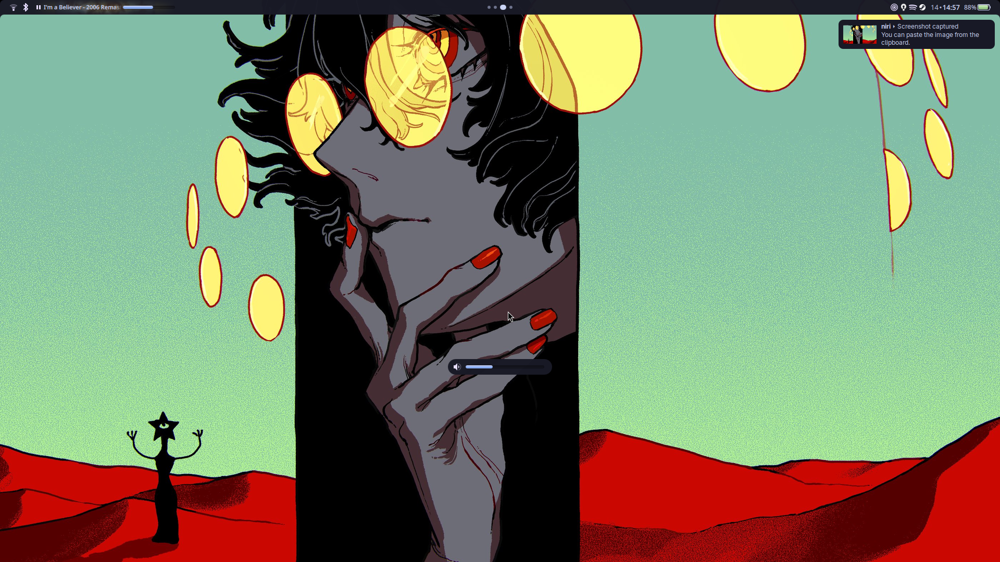

# dotfiles for EndeavourOS
This repository contains my personal dotfiles for an EndeavourOS Linux desktop setup, including a custom `quickshell` configuration, various lightweight utilities, and desktop tweaks.

## Configs
- fastfetch
- fuzzel
- ghostty
- mako
- niri
- quickshell

# Quickshell
A waybar inspired quickshell config.

## About
A minimalist bar written using quickshell, inspired by waybar. Intended to be used as a framework for easier quickshell adoptment.

### Features
- Minimal and modular configuration
- Easily extendable widget system
- Clean default theme
- Simple JSON-like syntax

### Screenshot


Most customization and configuration can be done from just two seperate files, `shell.qml` and `GlobalConfig.qml`.  Configs are simple and easy to read to users familiar with JSON and other like languages.

An example config:
```qml
/@ pragma UseQApplication

import QtQuick
import Quickshell

ShellRoot {
	Bar {
		height: 26
		padding: 9
		spacing: 6

		leftItems: [
			Network {},
			Bluetooth {}
		]
		centreItems: [
			NiriWorkspaces { command: ["niri", "msg", "action", "toggle-overview"]; }
		]
		rightItems: [
			Tray {},
			Clock {
				format: "hh:mm"
			},
			Battery {}
		]
	}
}
```

Widgets are self-contained, in other words users do not need to add import statements to their configs to add new widgets; simply extract and add the widget to their `shell.qml`.

## Installation
1. Install quickshell.
	- Arch
```bash
yay -S quickshell
```
2. Git clone this repository.
```bash
git clone https://github.com/rdnamil/dots.git
```
3. Copy the quickshell folder to your config folder.
```bash
cp dots/config/quickshell ~/.config
```
4. Run quickshell.
```bash
qs
```

## Roadmap
This project is far from complete but I feel that it's at a stage now where it can be shared. 

A couple of things still to do:
- refactor OSDs
- be able to change bar placement
- create more default widgets

This is by no means an exhaustive list and I will continue to fix/add things as I see the need.

## Share
Please share any comments, recommendations, or suggestions you may have. Also, if you've used this framework and created any bars or widgets, I'll happily link them here!
