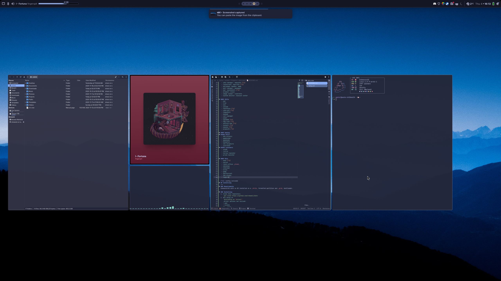

# Rdnamil's EndeavourOS dots
> **_NOTE:_** If you're looking for my quickshell configs, it's been moved over to [quickshell](https://github.com/rdnamil/quickshell).

> [!WARNING]
> Use at your own risk. This works for me, it may not work for your system!

## What's included
---
#### DE
 - wm: niri [^1]
 - greeter: greetd [^1]
 - term: ghostty [^1]
 - shell: zsh [^1]
 - file manager: thunar-devel [^1]
 - idle manager: swayidle [^1]
 - lockscreen: hyprlock [^1]
 - wallpaper daemon: swww
 - wall manager: waypaper
 - bar: quickshell [^1]
 - browser: brave
 - image viewer: ristretto
 - system monitor: mission center

#### Utils
 - bat
 - tree
 - eza
 - zoxide
 - fastfetch [^1]
 - cava-git [^1]
 - timeshift
 - baobab
 - virt-manager
 - piper
 - openRGB [^1]
 - nwg-look [^1]
 - qt5/6ct-kde [^1]
 - sunsetr [^1]
 - kanata [^1]
 - plymouth [^1]

#### Gaming
##### Utils
 - GPU drivers
 - gamescope
 - gamemode
 - mangohud
 - obs-vkcapture
 - oversteer
##### Launchers
 - steam
 - lutris
 - herioc-launcher
 - prism-launcher
 
#### Misc
 - kate [^1]
 - okular
 - libre-office _fresh_
 - obsidian
 - inkscape
 - krita
 - gimp
 - qbittorrent
 - obs-studio
 - legcord

[^1]: config included
## Installing
---
### Requirements
EndeavourOS with no DE installed on a _btrfs_ formatted partition and _grub_ bootloader.

### Installing
1. Clone this repository 
	`git clone https://github.com/rdnamil/dots`
2. Run setup.sh
	`dots/setup.sh [driver]`
	_driver options can include:
	--amd
	--nvidia
	or --intel
